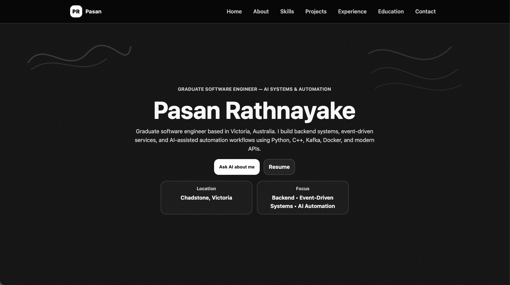

# Pasan Rathnayake — Developer Portfolio

Single-page developer portfolio with a dark lo‑fi zine aesthetic, a FastAPI backend, and an AI portfolio assistant.

## Highlights

- Full‑screen, sectioned layout with scroll reveal animations and a focused navigation bar.
- Data‑driven content from JSON files for About, Skills, Projects, Experience, and Education.
- AI portfolio assistant powered by LangGraph + OpenRouter with a local RAG index.
- SMTP-backed contact form with validation.
- Optional API access token and basic rate limiting for chat/contact endpoints.
- LLM logging controls with redaction options for safer production usage.

## Tech Stack

- **Frontend:** HTML, CSS, vanilla JavaScript
- **Backend:** FastAPI, Uvicorn
- **AI/RAG:** LangGraph, TF‑IDF vector store, OpenRouter
- **Email:** SMTP (TLS/SSL)

## Architecture

- **Frontend:** Static assets served by FastAPI from `frontend/`.
- **Backend:** REST endpoints for contact and chat in `backend/`.
- **RAG pipeline:** Indexes `knowledge/` at startup; uses top‑K retrieval to augment answers.
- **AI agent:** LangGraph state machine with OpenRouter chat completions.

## Content & Data

- **Content JSON:** `frontend/data/about.json`, `skills.json`, `projects.json`, `experience.json`, `education.json`
- **Social links:** `frontend/data/links.json`
- **Knowledge base:** `knowledge/` (source files for the AI agent)

## Security & Privacy

- Optional API access token for `/api/chat` and `/api/contact`.
- Per‑IP rate limiting for chat/contact requests.
- LLM call logging can be disabled or redacted via environment flags.

## Documentation

- Setup & installation: `INSTALLATION.md`
- Environment variables reference: `.env.example`
